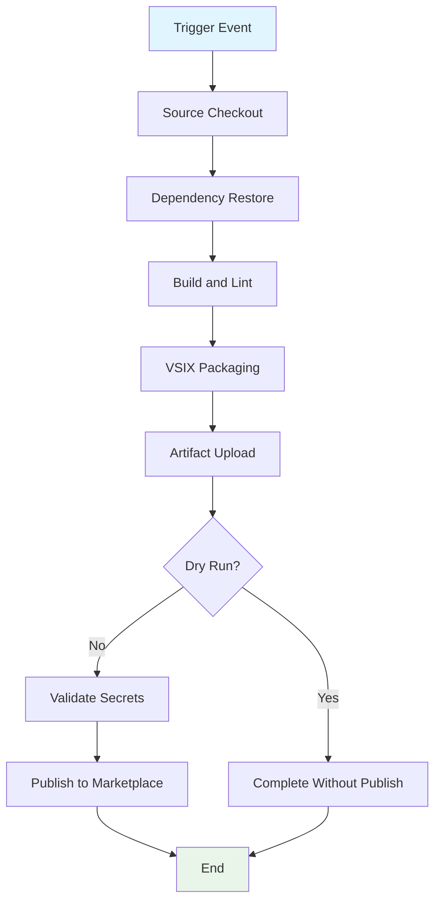

## Workflow Overview

**Purpose**: Publish the extension package to the Visual Studio Code Marketplace through a controlled CI/CD workflow.  
**Trigger Events**: Manual invocation and version-tag push events.  
**Target Environments**: GitHub-hosted CI runner and VS Code Marketplace publish endpoint.

## Execution Flow Diagram



## Jobs & Dependencies

| Job Name | Purpose                                   | Dependencies                                          | Execution Context                     |
| -------- | ----------------------------------------- | ----------------------------------------------------- | ------------------------------------- |
| publish  | Validate, package, and optionally publish | Trigger event, source access, and token for publish   | Linux hosted runner with Node runtime |

## Requirements Matrix

### Functional Requirements

| ID      | Requirement                                               | Priority | Acceptance Criteria                                      |
| ------- | --------------------------------------------------------- | -------- | -------------------------------------------------------- |
| REQ-001 | Execute on manual request and version tags                | High     | Run starts for each configured trigger class             |
| REQ-002 | Restore dependencies and compile extension sources        | High     | Build phase completes without compilation errors         |
| REQ-003 | Enforce source quality validation before packaging        | High     | Lint gate passes before package creation                 |
| REQ-004 | Produce a VSIX artifact for each run                      | High     | Packaged VSIX is available as a workflow artifact        |
| REQ-005 | Support a non-publishing validation path                  | Medium   | Dry-run mode completes without publish action            |
| REQ-006 | Publish only when required credentials exist              | High     | Publish path fails fast when credential is missing       |
| REQ-007 | Publish the generated VSIX package to Marketplace         | High     | Publish operation completes successfully                 |

### Security Requirements

| ID      | Requirement                          | Implementation Constraint                                  |
| ------- | ------------------------------------ | ---------------------------------------------------------- |
| SEC-001 | Publish credential is secret-scoped  | Token is sourced from encrypted repository secrets         |
| SEC-002 | CI permissions follow least privilege| Workflow permissions are limited to required read access   |
| SEC-003 | Secret value is never logged         | Execution path avoids echoing or persisting secret values  |

### Performance Requirements

| ID       | Metric              | Target        | Measurement Method                                  |
| -------- | ------------------- | ------------- | --------------------------------------------------- |
| PERF-001 | End-to-end duration | ≤ 20 minutes  | Workflow runtime timestamps from CI summary         |
| PERF-002 | Packaging latency   | ≤ 5 minutes   | Time from build start to VSIX artifact creation     |

## Input/Output Contracts

### Inputs

```yaml
# Workflow Inputs
dry_run: boolean  # Purpose: toggle publish step execution

# Repository Triggers
tags: [v*]
manual_dispatch: true
```

### Outputs

```yaml
# Job Outputs
build_artifact: file    # Description: packaged VSIX extension artifact
publish_result: string  # Description: publish outcome status in logs
```

### Secrets & Variables

| Type     | Name     | Purpose                                                | Scope               |
| -------- | -------- | ------------------------------------------------------ | ------------------- |
| Secret   | VSCE_PAT | Authenticates publish operation to VS Code Marketplace | Repository/Workflow |
| Variable | dry_run  | Controls publish skip behavior for validation runs     | Workflow input      |

## Execution Constraints

### Runtime Constraints

- **Timeout**: Single-job execution must not exceed 20 minutes.
- **Concurrency**: One run per source-ref group to avoid duplicate publish attempts.
- **Resource Limits**: Standard hosted-runner resources must support build and publish.

### Environmental Constraints

- **Runner Requirements**: Linux runner with Node-compatible environment.
- **Network Access**: Outbound connectivity to package registry and Marketplace endpoints.
- **Permissions**: Source read access plus secret retrieval on publish path.

## Error Handling Strategy

| Error Type                | Response                       | Recovery Action                                      |
| ------------------------- | ------------------------------ | ---------------------------------------------------- |
| Dependency/Build Failure  | Stop run before packaging      | Correct source/build definitions, then rerun         |
| Lint Failure              | Stop run before packaging      | Resolve lint violations, then rerun                  |
| Packaging Failure         | Stop run before publish        | Fix packaging configuration, then rerun              |
| Missing Credential        | Fail fast in prerequisite check| Add/repair secret and rerun                          |
| Publish Failure           | Mark workflow failed           | Review response, adjust version/token, then rerun    |

## Quality Gates

### Gate Definitions

| Gate          | Criteria                                           | Bypass Conditions                           |
| ------------- | -------------------------------------------------- | ------------------------------------------- |
| Build Gate    | Compilation succeeds with no errors                | None                                        |
| Lint Gate     | Source passes configured lint rules                | None                                        |
| Packaging Gate| VSIX file is generated and stored                  | None                                        |
| Publish Gate  | Credential check passes and publish call succeeds  | Dry-run mode intentionally bypasses publish |

## Monitoring & Observability

### Key Metrics

- **Success Rate**: Target ≥ 99% for non-source-breaking changes.
- **Execution Time**: Track median and p95 workflow duration.
- **Resource Usage**: Monitor runner usage via CI timing and cache efficiency.

### Alerting

| Condition                             | Severity | Notification Target   |
| ------------------------------------- | -------- | --------------------- |
| Publish step failure                  | High     | Repository maintainers|
| Repeated build/lint failure trend     | Medium   | Development team      |
| Missing credential on release path    | High     | Release owners        |

## Integration Points

### External Systems

| System                            | Integration Type      | Data Exchange                 | SLA Requirements                         |
| --------------------------------- | --------------------- | ----------------------------- | ---------------------------------------- |
| npm registry                      | Dependency retrieval  | Package metadata and tarballs | Available during CI execution window     |
| VS Code Marketplace               | Publish API           | VSIX artifact and auth token  | Endpoint accessible during release runs  |
| GitHub Actions artifact storage   | Artifact persistence  | VSIX binary output            | Artifact upload succeeds per run         |

### Dependent Workflows

| Workflow                         | Relationship                            | Trigger Mechanism                      |
| -------------------------------- | --------------------------------------- | -------------------------------------- |
| Build/test workflows (if present)| Optional predecessor for release safety | Organizational policy or manual gating |

## Compliance & Governance

### Audit Requirements

- **Execution Logs**: Retain run logs per repository and organization policy.
- **Approval Gates**: Use protected release/tag processes where required.
- **Change Control**: Update this specification before workflow behavior changes.

### Security Controls

- **Access Control**: Restrict secret management and release triggers to maintainers.
- **Secret Management**: Rotate publish token on schedule and on exposure risk.
- **Vulnerability Scanning**: Validate dependencies in standard security reviews.

## Edge Cases & Exceptions

### Scenario Matrix

| Scenario                         | Expected Behavior                                 | Validation Method                            |
| -------------------------------- | ------------------------------------------------- | -------------------------------------------- |
| Manual dry-run                   | Build/lint/package runs, publish is skipped       | Verify publish step is not executed          |
| Duplicate version publish attempt| Publish fails with version conflict               | Observe marketplace conflict message in logs |
| Missing VSCE_PAT                 | Workflow fails before publish call                | Validate prerequisite check output           |
| Tag push without code readiness  | Build/lint gates block release                    | Confirm no publish action occurs             |

## Validation Criteria

### Workflow Validation

- **VLD-001**: Tag trigger initiates one publish workflow run.
- **VLD-002**: Dry-run mode produces VSIX artifact and no publish action.
- **VLD-003**: Publish path requires valid secret and successful package creation.

### Performance Benchmarks

- **PERF-001**: Median runtime remains within target bound.
- **PERF-002**: Artifact generation completes within packaging target.

## Change Management

### Update Process

1. **Specification Update**: Modify this document first.
2. **Review & Approval**: Obtain maintainer approval.
3. **Implementation**: Apply workflow changes in repository CI definitions.
4. **Testing**: Execute manual dry-run validation.
5. **Deployment**: Apply via merge/tag according to release policy.

### Version History

| Version | Date       | Changes                | Author         |
| ------- | ---------- | ---------------------- | -------------- |
| 1.0     | 2026-02-22 | Initial specification  | GitHub Copilot |

## Related Specifications

- [CI/CD Workflow Specification - Publish VS Code Extension](spec-process-cicd-publish-vscode-extension.md)
