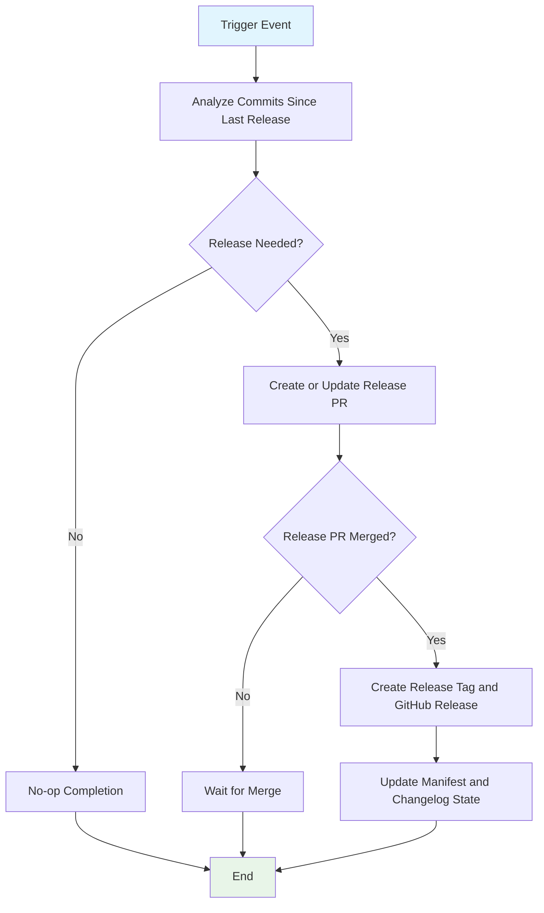

## Workflow Overview

**Purpose**: Automate release proposal and release publication by converting eligible commits into versioned release metadata.
**Trigger Events**: Push events on the default branch and manual workflow dispatch.
**Target Environments**: GitHub Actions runner and GitHub repository release interface.

## Execution Flow Diagram



## Jobs & Dependencies

| Job Name       | Purpose                                               | Dependencies                                    | Execution Context            |
| -------------- | ----------------------------------------------------- | ----------------------------------------------- | ---------------------------- |
| release-please | Decide release eligibility and create PR/release flow | Trigger event and repository write permissions  | Linux hosted GitHub runner   |

## Requirements Matrix

### Functional Requirements

| ID      | Requirement                                                   | Priority | Acceptance Criteria                                                  |
| ------- | ------------------------------------------------------------- | -------- | -------------------------------------------------------------------- |
| REQ-001 | Evaluate commit history on each default-branch push           | High     | Workflow runs for each matching push event                           |
| REQ-002 | Support manual invocation for operational control             | Medium   | Workflow can be started through manual dispatch                      |
| REQ-003 | Create or update a release PR when releasable changes exist   | High     | Release PR is present and reflects pending version/changelog changes |
| REQ-004 | Produce version tag and release record after PR merge         | High     | New semantic version tag and release record are created              |
| REQ-005 | Maintain changelog and version-manifest continuity            | High     | Changelog and manifest state reflect latest published release        |

### Security Requirements

| ID      | Requirement                                      | Implementation Constraint                                         |
| ------- | ------------------------------------------------ | ----------------------------------------------------------------- |
| SEC-001 | Workflow token access is least-privilege         | Scope permissions to release content and pull request operations  |
| SEC-002 | Release actions are limited to trusted branches  | Trigger scope is restricted to the default branch release path    |
| SEC-003 | Release metadata changes are auditable           | All PR/tag/release mutations are recorded in repository history   |

### Performance Requirements

| ID       | Metric                           | Target       | Measurement Method                                |
| -------- | -------------------------------- | ------------ | ------------------------------------------------- |
| PERF-001 | Median workflow runtime          | ≤ 10 minutes | CI runtime statistics across successful runs      |
| PERF-002 | Release PR update responsiveness | ≤ 5 minutes  | Time from trigger to PR creation/update event     |

## Input/Output Contracts

### Inputs

```yaml
# Repository Triggers
branches: [main]
manual_dispatch: true

# Release Metadata Sources
commit_messages: conventional_commits
manifest_file: release version baseline per package path
config_file: release strategy and package map
```

### Outputs

```yaml
# Process Outputs
release_pr: pull_request  # Description: pending release proposal when changes qualify
release_tag: string       # Description: semantic version tag emitted after release PR merge
release_record: object    # Description: published release metadata in repository releases
```

### Secrets & Variables

| Type     | Name                 | Purpose                                         | Scope       |
| -------- | -------------------- | ----------------------------------------------- | ----------- |
| Variable | release configuration| Defines package release strategy and semantics  | Repository  |
| Variable | release manifest     | Tracks last published version per package path  | Repository  |

## Execution Constraints

### Runtime Constraints

- **Timeout**: Each release-evaluation run should complete within 15 minutes.
- **Concurrency**: One active run per branch reference to prevent conflicting updates.
- **Resource Limits**: Standard hosted-runner resources should be sufficient for metadata-only operations.

### Environmental Constraints

- **Runner Requirements**: Linux hosted runner with GitHub API connectivity.
- **Network Access**: Access to GitHub repository APIs for PR, tag, and release operations.
- **Permissions**: Content write and pull-request write scopes are required for release mutations.

## Error Handling Strategy

- **Invalid release configuration**
  - Response: Fail run and stop mutation
  - Recovery: Correct config/manifest files and rerun
- **Missing release-eligible commits**
  - Response: Exit without PR/release mutation
  - Recovery: No action required
- **Pull request creation failure**
  - Response: Fail run and preserve logs
  - Recovery: Resolve branch/protection/API issue and rerun
- **Tag/release publication failure**
  - Response: Fail run after PR merge attempt
  - Recovery: Resolve conflict/permission issue and rerun or perform controlled retry

## Quality Gates

### Gate Definitions

- **Commit Semantics Gate**
  - Criteria: Commit metadata is parseable for release classification
  - Bypass: None
- **Release PR Gate**
  - Criteria: PR content includes version and changelog updates
  - Bypass: None
- **Publication Gate**
  - Criteria: Release PR is merged before tag/release publication
  - Bypass: Manual dispatch still enforces merge rule

## Monitoring & Observability

### Key Metrics

- **Success Rate**: Percentage of runs completing without operational errors.
- **Execution Time**: Median and p95 runtime for release evaluation.
- **Release Throughput**: Number of release PRs and published releases over time.

### Alerting

| Condition                            | Severity | Notification Target      |
| ------------------------------------ | -------- | ------------------------ |
| Repeated release PR creation failure | High     | Repository maintainers   |
| Tag/release publish failure          | High     | Release owners           |
| Configuration parse failure          | Medium   | CI/CD maintainers        |

## Integration Points

### External Systems

- **GitHub Pull Requests**
  - Integration Type: Repository API mutation
  - Data Exchange: Release PR title/body and version/changelog diffs
  - SLA: Available during CI runtime window
- **Git Tags**
  - Integration Type: Repository API mutation
  - Data Exchange: Semantic version tag references
  - SLA: Tag creation endpoint available
- **GitHub Releases**
  - Integration Type: Repository API mutation
  - Data Exchange: Release notes and version metadata
  - SLA: Release publishing endpoint available

### Dependent Workflows

| Workflow                  | Relationship                                         | Trigger Mechanism                        |
| ------------------------- | ---------------------------------------------------- | ---------------------------------------- |
| publish-vscode-extension  | Consumes release tags to publish VSIX to Marketplace | Tag-based trigger after release creation |

## Compliance & Governance

### Audit Requirements

- **Execution Logs**: Preserve workflow logs under repository retention policy.
- **Approval Gates**: Require PR review/merge policy for release proposal branch.
- **Change Control**: Update workflow specification before release-process modifications.

### Security Controls

- **Access Control**: Restrict workflow modification and merge permissions to maintainers.
- **Secret Management**: Use built-in token model with minimal required scope.
- **Vulnerability Scanning**: Validate release configuration changes through code review.

## Edge Cases & Exceptions

### Scenario Matrix

- **No releasable commit types**
  - Expected: Workflow completes without release PR
  - Validation: Confirm no PR/tag creation activity
- **Existing release PR already open**
  - Expected: Workflow updates existing PR instead of creating duplicate
  - Validation: Verify single active release PR
- **Concurrent pushes on default branch**
  - Expected: Concurrency policy serializes effective release mutation
  - Validation: Confirm no conflicting duplicate release operations
- **Manifest/version drift from repository**
  - Expected: Workflow fails or blocks mutation with actionable errors
  - Validation: Review run logs and correct manifest/config

## Validation Criteria

### Workflow Validation

- **VLD-001**: Default-branch push triggers release evaluation.
- **VLD-002**: Releasable commits generate a release PR with version/changelog updates.
- **VLD-003**: Merged release PR results in semantic tag and GitHub release.
- **VLD-004**: Non-releasable commits result in no release mutation.

### Performance Benchmarks

- **PERF-001**: Median runtime stays within defined target.
- **PERF-002**: PR creation/update latency stays within defined target.

## Change Management

### Update Process

1. **Specification Update**: Modify this document first.
2. **Review & Approval**: Obtain maintainer review for process changes.
3. **Implementation**: Apply updates to workflow and release configuration files.
4. **Testing**: Validate via controlled push or manual workflow dispatch.
5. **Deployment**: Merge approved changes into default branch.

### Version History

| Version | Date       | Changes                              | Author         |
| ------- | ---------- | ------------------------------------ | -------------- |
| 1.0     | 2026-02-22 | Initial release-please specification | GitHub Copilot |

## Related Specifications

- [CI/CD Workflow Specification - Release Please](spec-process-cicd-release-please.md)
- [CI/CD Workflow Specification - Publish VS Code Extension](spec-process-cicd-publish-vscode-extension.md)
